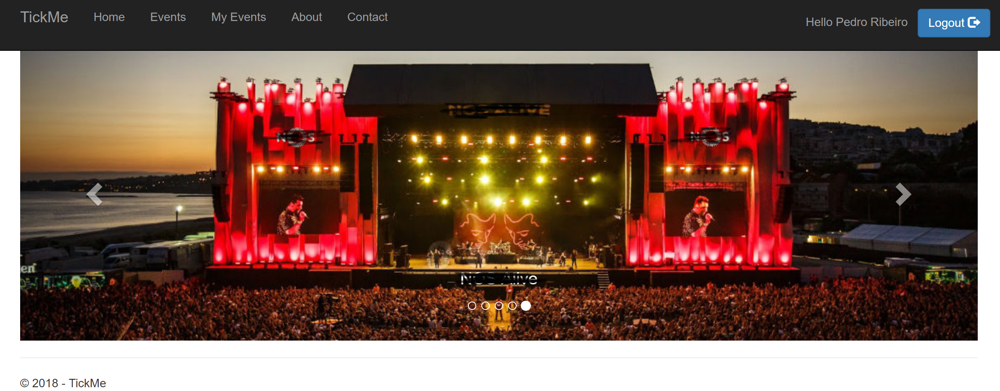

# TickMe

A sample ASP.NET Core application to sell tickets that serves as a base for a Containers Workshop.
This is the first part of the tutorial.
You can find the second part [here](https://github.com/etpedror/TickMeMicroservices), and the final one [here](https://github.com/etpedror/TickMeContainers)

## Overview

TickMe is a ticket selling website that is growing in popularity. While the current monolithic application still works, to cope with higher loads in an efficient manner, it was decided to go for a microservices architecture and to use containers.

[Initial Setup](./Tutorial/initialsetup.md)  
[Creating the Azure Items](./Tutorial/createazurepart.md)  
[Preparing your workstation](./Tutorial/prepareworkstation.md)  

Proceed to the [Second Part of this Workshop](https://github.com/etpedror/TickMeMicroservices), where we will turn this application into a Microservices oriented application
