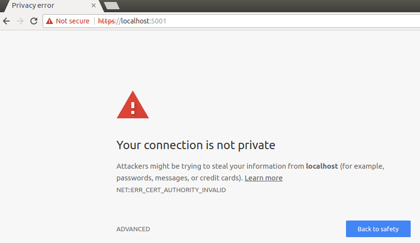
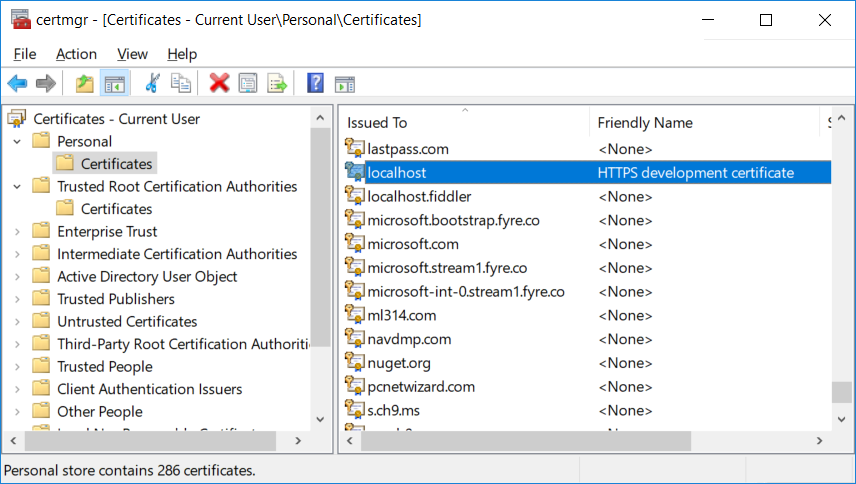
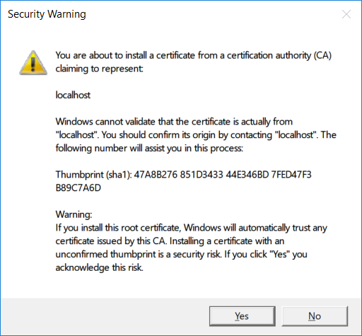

# Preparing your workstation

Preparing the workstation is all about getting the solution to work with the azure components and also to work correctly with HTTPS

[Getting the application on the workstation](#getting-the-application-on-the-workstation)  
[Enabling HTTPS](#enabling-https)  
[Create a certificate](#create-a-certificate)
[Trust the certificate](#trust-the-certificate)
[Configure Kestrel to use the certificate we generated](#configure-kestrel-to-use-the-certificate-we-generated)
[Run your application](#run-your-application)
[Redirect from HTTP to HTTPS](#redirect-from-http-to-https)

---

## Getting the application on the workstation

1. Open a terminal window
   - On Windows, press the __Windows__ key, type _`cmd`_ and press _`Enter`_
   - On OSX, press __cmd__ + __space__, type _`terminal`_ and press _`Enter`_
   - On Linux, press __ctrl__ + __alt__ + __T__

2. Navigate to the folder where you wish to have the code on

3. Type _`git clone https://github.com/etpedror/TickMe.git`_. This creates a clone of this repository on your workstation.

4. Using Visual Studio or Visual Studio Code, open the file _appsettings.json_ that you can find in the folder _TickMe_ inside the folder that was cloned from GitHub. You will need to add some configuration values:

```javascript
    "KeyVault": {
        "Vault": "<KV.Name on your file>",
        "ClientId": "<AAD.ApplicationId on your file>",
        "ClientSecret": "<AAD.ClientSecret on your file>"
    }
```

[Back to top](#preparing-your-workstation)

---

## Enabling HTTPS

We now need to focus on enabling HTTPS in ASP.NET Core during development using Kestrel (the ASP.NET Core server). When using Visual Studio you can alternatively enable HTTPS in the Debug tab of your app to easily have IIS Express enable HTTPS without it going all the way to Kestrel. This closely mimics what you would have if you’re handling HTTPS connections in production using IIS. However, when running from the command-line or in a non-Windows environment you must instead enable HTTPS directly using Kestrel. This part of the document is based on the excelent blog post [Configuring HTTPS in ASP.NET Core across different platforms](https://blogs.msdn.microsoft.com/webdev/2017/11/29/configuring-https-in-asp-net-core-across-different-platforms/), by Daniel Roth.

The basic steps we will use for each OS are:

1. Create a self-signed certificate that Kestrel can use
2. Optionally trust the certificate so that your browser will not warn you about using a self-signed certificate
3. Configure Kestrel to use that certificate

[Back to top](#preparing-your-workstation)

---

## Create a certificate

### Windows

Use the New-SelfSignedCertificate Powershell cmdlet to generate a suitable certificate for development:

```Powershell
New-SelfSignedCertificate -NotBefore (Get-Date) -NotAfter (Get-Date).AddYears(1) -Subject "localhost" -KeyAlgorithm "RSA" -KeyLength 2048 -HashAlgorithm "SHA256" -CertStoreLocation "Cert:\CurrentUser\My" -KeyUsage KeyEncipherment -FriendlyName "HTTPS development certificate" -TextExtension @("2.5.29.19={critical}{text}","2.5.29.37={critical}{text}1.3.6.1.5.5.7.3.1","2.5.29.17={critical}{text}DNS=localhost")
```

### Linux & Mac

For Linux and Mac we will use OpenSSL. Create a file https.config with the following data:

```config
[ req ]
default_bits = 2048
default_md = sha256
default_keyfile = key.pem
prompt = no
encrypt_key = no

distinguished_name = req_distinguished_name
req_extensions = v3_req
x509_extensions = v3_req

[ req_distinguished_name ]
commonName = "localhost"

[ v3_req ]
subjectAltName = DNS:localhost
basicConstraints = critical, CA:false
keyUsage = critical, keyEncipherment
extendedKeyUsage = critical, 1.3.6.1.5.5.7.3.1
```

Run the following command to generate a private key and a certificate signing request:

_`openssl req -config https.config -new -out csr.pem`_

Run the following command to create a self-signed certificate:

_`openssl x509 -req -days 365 -extfile https.config -extensions v3_req -in csr.pem -signkey key.pem -out https.crt`_

Run the following command to generate a pfx file containing the certificate and the private key that you can use with Kestrel:

_`openssl pkcs12 -export -out https.pfx -inkey key.pem -in https.crt -password pass:<password>`_

Make a note of the password on your file under PFX.Password

[Back to top](#preparing-your-workstation)

---

## Trust the certificate

This step is optional, but without it the browser will warn you about your site being potentially unsafe. You will see something like the following if you browser doesn’t trust your certificate:


### Windows

To trust the generated certificate on Windows you need to add it to the current user’s trusted root store:

1. Open a command window (press the __Windows__ key and type _`cmd`_)  
2. Run _`certmgr.msc`_  
3. Find the certificate under __Personal/Certificates__. The “Issued To” field should be _localhost_ and the “Friendly Name” should be _HTTPS development certificate_

  

4. Copy the certificate and paste it under _Trusted Root Certification Authorities/Certificates_. When Windows presents a security warning dialog to confirm you want to trust the certificate, click on “Yes”

  

### Linux

There is no centralized way of trusting the a certificate on Linux so you can do one of the following:

- Exclude the URL you are using in your browsers exclude list
- Trust all self-signed certificates on localhost
- Add the https.crt to the list of trusted certificates in your browser
- How exactly to achieve this depends on your browser/distro

### Mac

#### Option 1: Command line

Run the following command:

_`sudo security add-trusted-cert -d -r trustRoot -k /Library/Keychains/System.keychain https.crt`_

Some browsers, such as Chrome, require you to restart them before this trust will take affect.

#### Option 2: Keychain UI

If you open the “Keychain Access” app you can drag your https.crt into the Login keychain.

[Back to top](#preparing-your-workstation)

---

## Configure Kestrel to use the certificate we generated

To configure Kestrel to use the generated certificate, add the following code and configuration to your application.

### Application code

This code will read a set of HTTP server endpoint configurations from a custom section in your app configuration settings and then apply them to Kestrel. The endpoint configurations include settings for configuring HTTPS, like which certificate to use. Add the code for the _ConfigureEndpoints_ extension method to your application and then call it when setting up Kestrel for your host in _Program.cs_:

Create a class to contain the Endpoint configuration

```c#
public class EndpointConfiguration
{
    public string Host { get; set; }
    public int? Port { get; set; }
    public string Scheme { get; set; }
    public string StoreName { get; set; }
    public string StoreLocation { get; set; }
    public string FilePath { get; set; }
    public string Password { get; set; }
}
```

And a class to contain the extension method

```c#
public static class KestrelServerOptionsExtensions
{
    public static void ConfigureEndpoints(this KestrelServerOptions options)
    {
        var configuration = options.ApplicationServices.GetRequiredService<IConfiguration>();
        var environment = options.ApplicationServices.GetRequiredService<IHostingEnvironment>();

        var endpoints = configuration.GetSection("HttpServer:Endpoints")
            .GetChildren()
            .ToDictionary(section => section.Key, section =>
            {
                var endpoint = new EndpointConfiguration(); 
                section.Bind(endpoint); 
                return endpoint;
            });

        foreach (var endpoint in endpoints)
        {
            var config = endpoint.Value;
            var port = config.Port ?? (config.Scheme == "https" ? 443 : 80);

            var ipAddresses = new List<IPAddress>();
            if (config.Host == "localhost")
            {
                ipAddresses.Add(IPAddress.IPv6Loopback);
                ipAddresses.Add(IPAddress.Loopback);
            }
            else if (IPAddress.TryParse(config.Host, out var address))
            {
                ipAddresses.Add(address);
            }
            else
            {
                ipAddresses.Add(IPAddress.IPv6Any);
            }

            foreach (var address in ipAddresses)
            {
                options.Listen(address, port,
                    listenOptions =>
                    {
                        if (config.Scheme == "https")
                        {
                            var certificate = LoadCertificate(config, environment);
                            listenOptions.UseHttps(certificate);
                        }
                    });
            }
        }
    }

    private static X509Certificate2 LoadCertificate(EndpointConfiguration config, IHostingEnvironment environment)
    {
        if (config.StoreName != null && config.StoreLocation != null)
        {
            using (var store = new X509Store(config.StoreName, Enum.Parse<StoreLocation>(config.StoreLocation)))
            {
                store.Open(OpenFlags.ReadOnly);
                var certificate = store.Certificates.Find(
                    X509FindType.FindBySubjectName,
                    config.Host,
                    validOnly: !environment.IsDevelopment());

                if (certificate.Count == 0)
                {
                    throw new InvalidOperationException($"Certificate not found for {config.Host}.");
                }

                return certificate[0];
            }
        }

        if (config.FilePath != null && config.Password != null)
        {
            return new X509Certificate2(config.FilePath, config.Password);
        }

        throw new InvalidOperationException("No valid certificate configuration found for the current endpoint.");
    }
}
```

Add the extension method to the _BuildWebHost_ method of the _Program_ class in _program.cs_, so that it look somewhat like this:

```c#
WebHost.CreateDefaultBuilder(args)
            .UseStartup<Startup>()
            .UseKestrel(options => options.ConfigureEndpoints())
            .Build();
```
Now what needs to be done is configure our endpoints and HTTPS settings

### Windows Sample Configuration

To configure your endpoints and HTTPS settings on Windows you could then put the following into your appsettings.Development.json, which configures an HTTPS endpoint for your application using a certificate in a certificate store

```javascript
{
    "HttpServer":{
        "Endpoints":{
            "Http":{
                "Host": "localhost",
                "Port": 50080,
                "Scheme": "http"
            },
            "Https":{
                "Host": "localhost",
                "Port": 44380,
                "Scheme": "https",
                "StoreName": "My",
                "StoreLocation": "CurrentUser"
            }
        }
    }
}
```

### Linux and Mac Sample Configuration

On Linux or Mac your appsettings.Development.json would look something like this, where your certificate is specified using a file path

```javascript
{
    "HttpServer":{
        "Endpoints":{
            "Http":{
                "Host": "localhost",
                "Port": 50080,
                "Scheme": "http"
            },
            "Https":{
                "Host": "localhost",
                "Port": 44380,
                "Scheme": "https",
                "FilePath": "./Certificate/https.pfx"
            }
        }
    }
}
```

You can then use the _user secrets tool_, environment variables, or some secure store such as Azure KeyVault to store the password of your certificate using the HttpServer:Endpoints:Https:Password configuration key instead of storing the password in a file that goes into source control.

For example, to store the certificate password as a user secret during development, run the following command from your project (not from the solution folder, from the same folder where tickme.csproj resides):

_`dotnet user-secrets set HttpServer:Endpoints:Https:Password <PFC.Password from your file>`_

To override the certificate password using an environment variable, create an environment variable named _HttpServer:Endpoints:Https:Password_ (or HttpServer__Endpoints__Https__Password if your system does not allow :) with the value of the certificate password.

[Back to top](#preparing-your-workstation)

---

## Run your application

When running from Visual Studio you can change the default launch URL for your application to use the HTTPS address by modifying the _launchSettings.json_ file that you can find inside the Properties folder of your project

```javascript
{
  "iisSettings": {
    "windowsAuthentication": false,
    "anonymousAuthentication": true,
    "iisExpress": {
      "applicationUrl": "http://localhost:50080/",
      "sslPort": 44380
    }
  },
  "profiles": {
    "IIS Express": {
      "commandName": "IISExpress",
      "launchBrowser": true,
      "launchUrl": "https://localhost:44380/",
      "environmentVariables": {
        "ASPNETCORE_ENVIRONMENT": "Development"
      }
    },
    "KestrelHttpsTest": {
      "commandName": "Project",
      "launchBrowser": true,
      "launchUrl": "https://localhost:44380",
      "environmentVariables": {
        "ASPNETCORE_ENVIRONMENT": "Development"
      },
      "applicationUrl": "http://localhost:50080/"
    }
  }
}
```

[Back to top](#preparing-your-workstation)

---

## Redirect from HTTP to HTTPS

When you setup your site to use HTTPS by default, you typically want to allow HTTP requests, but have them redirected to the corresponding HTTPS address. In ASP.NET Core this can be accomplished using the URL rewrite middleware. Place the following code in the _Configure_ method of your _Startup_ class:

```c#
int? httpsPort = null;
var httpsSection = Configuration.GetSection("HttpServer:Endpoints:Https");
if (httpsSection.Exists())
{
    var httpsEndpoint = new EndpointConfiguration();
    httpsSection.Bind(httpsEndpoint);
    httpsPort = httpsEndpoint.Port;
}
var statusCode = env.IsDevelopment() ? StatusCodes.Status302Found : StatusCodes.Status301MovedPermanently;
app.UseRewriter(new RewriteOptions().AddRedirectToHttps(statusCode, httpsPort));
```

Once you do it, you should be able to run the application and login, as well as see the events and buy tickets.

Proceed to the [Second Part of this Workshop](https://github.com/etpedror/TickMeMicroservices), where we will turn this application into a Microservices oriented application

[Back to top](#preparing-your-workstation)

---

[Previous Step - Create Azure Part](./createazurepart.md)   
[Back to Start](../README.md)